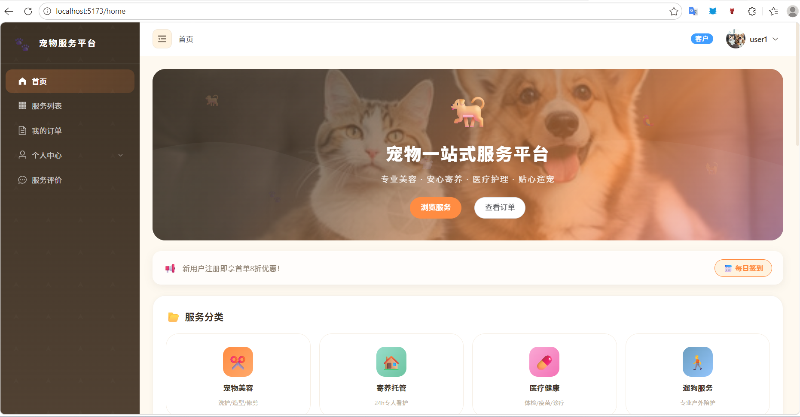
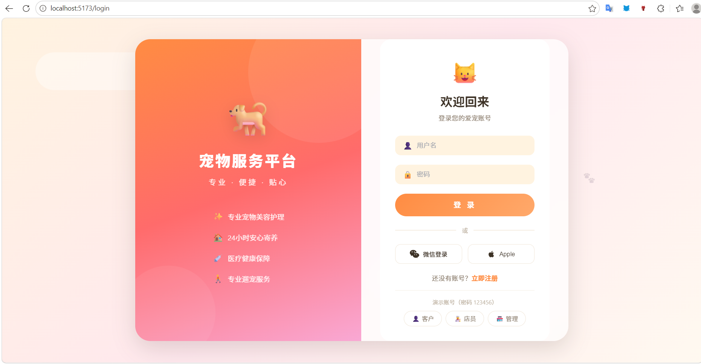
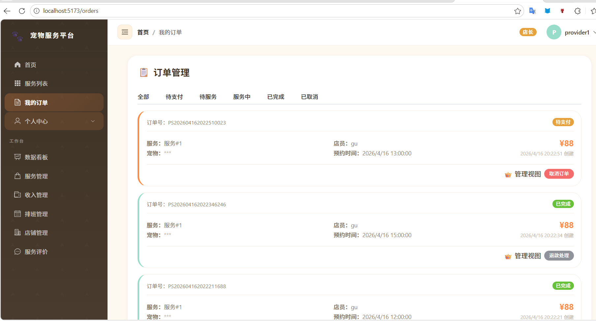
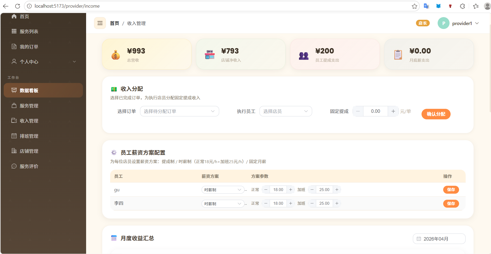
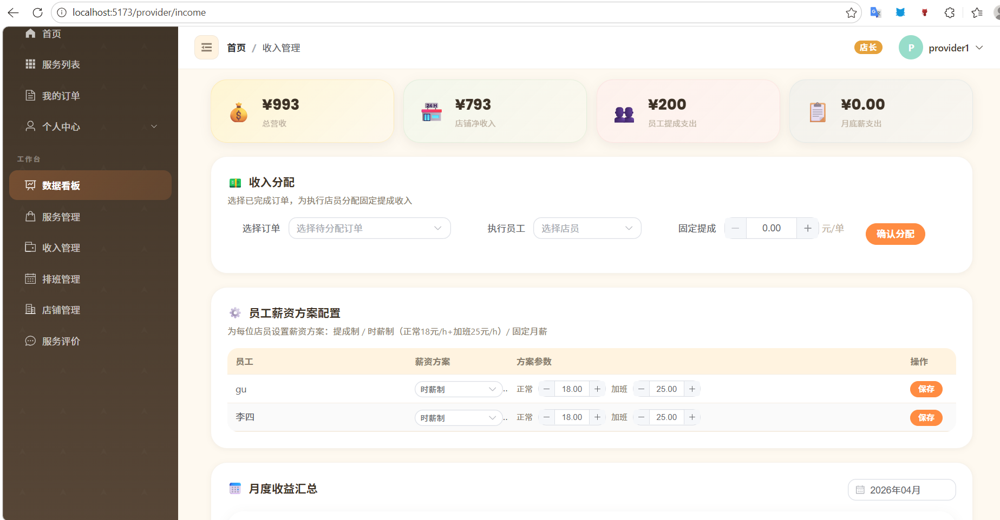
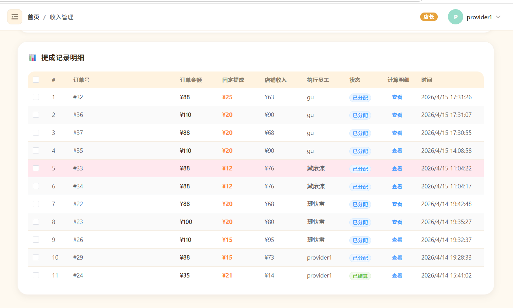
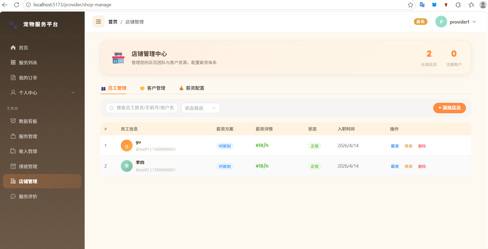
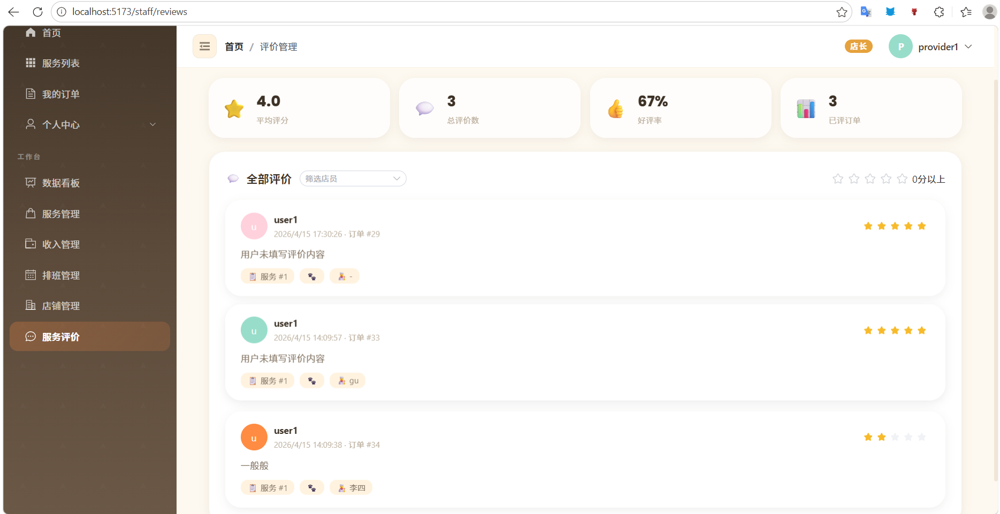

# 宠物服务系统 (Pet Service System)

<div align="center">

[](LICENSE)
[](https://spring.io/projects/spring-boot)
[](https://vuejs.org/)
[](https://www.mysql.com/)
[](https://redis.io/)

一个基于Spring Boot + Vue.js的全栈宠物服务平台，提供宠物服务预约、商家管理、用户管理等功能。

</div>

## 🚀 项目概述

宠物服务系统是一个现代化的Web应用，旨在为宠物主人、服务提供商和平台管理员提供全方位的服务管理解决方案。系统采用前后端分离架构，具有高可扩展性和易维护性。

## 项目截图

















## ✨ 主要功能

### 宠物主人功能
- **用户认证**: 注册/登录与JWT身份验证
- **宠物管理**: 宠物档案管理（姓名、品种、年龄、健康状况等）
- **服务预约**: 在线选择服务、预约时间、查看订单状态
- **个人中心**: 个人资料管理、订单历史、宠物信息管理
- **积分商城**: 积分兑换礼品功能

### 服务提供商功能
- **服务管理**: 服务项目发布、价格设置、服务描述
- **日程管理**: 预约时间表管理、可用时间段设置
- **收入管理**: 收入统计、财务报表
- **评价管理**: 查看用户评价、回复评价
- **店铺管理**: 店铺信息管理、营业时间设置
- **员工管理**: 员工信息管理、排班安排、业绩统计

### 系统管理员功能
- **用户管理**: 用户列表、权限分配、账户状态管理
- **服务管理**: 服务审核、分类管理、平台规则设置
- **订单管理**: 订单监控、纠纷处理
- **商家审核**: 商家入驻申请审核
- **数据统计**: 平台运营数据分析
- **系统配置**: 参数配置、系统维护
- **日志管理**: 操作日志、安全审计

## 🛠️ 技术栈

### 后端技术栈
| 技术 | 版本 | 描述 |
|------|------|------|
| [Spring Boot](https://spring.io/projects/spring-boot) | 3.2.5 | 应用框架 |
| [Spring Security](https://spring.io/projects/spring-security) | 3.2.5 | 安全框架 |
| [Spring Data Redis](https://spring.io/projects/spring-data-redis) | 3.2.5 | Redis集成 |
| [MyBatis-Plus](https://baomidou.com/) | 3.5.7 | ORM框架 |
| [MySQL](https://www.mysql.com/) | 8+ | 关系型数据库 |
| [JWT](https://jwt.io/) | 0.12.5 | JSON Web Token |
| [Maven](https://maven.apache.org/) | 3.9+ | 依赖管理 |

### 前端技术栈
| 技术 | 版本 | 描述 |
|------|------|------|
| [Vue.js](https://vuejs.org/) | 3.4.21 | JavaScript框架 |
| [Vue Router](https://router.vuejs.org/) | 4.3.0 | 路由管理 |
| [Pinia](https://pinia.vuejs.org/) | 2.1.7 | 状态管理 |
| [Element Plus](https://element-plus.org/) | 2.6.3 | UI组件库 |
| [Axios](https://axios-http.com/) | 1.7.2 | HTTP客户端 |
| [Vite](https://vitejs.dev/) | 5.2.8 | 构建工具 |

### 运维部署
- [Docker](https://www.docker.com/) - 容器化部署
- [Docker Compose](https://docs.docker.com/compose/) - 多容器编排

## 🏗️ 项目架构

```
pet-service-system/
├── backend/                 # Spring Boot 后端服务
│   ├── src/main/java/com/petservice/
│   │   ├── common/          # 通用工具类
│   │   ├── config/          # 配置类
│   │   ├── controller/      # 控制器层 (REST API)
│   │   ├── dto/             # 数据传输对象
│   │   ├── entity/          # 实体类 (JPA实体)
│   │   ├── mapper/          # 数据访问层 (MyBatis-Plus)
│   │   ├── security/        # 安全相关
│   │   └── service/         # 业务逻辑层
│   └── src/main/resources/
│       └── application.yml  # 配置文件
├── frontend/                # Vue.js 前端项目
│   ├── src/
│   │   ├── api/             # API接口定义
│   │   ├── assets/          # 静态资源
│   │   ├── components/      # 可复用组件
│   │   ├── layouts/         # 布局组件
│   │   ├── router/          # 路由配置
│   │   ├── stores/          # Pinia状态管理
│   │   ├── utils/           # 工具函数
│   │   ├── views/           # 页面组件
│   │   │   ├── admin/       # 管理员页面
│   │   │   ├── community/   # 社区页面
│   │   │   ├── home/        # 首页
│   │   │   ├── order/       # 订单页面
│   │   │   ├── points/      # 积分商城
│   │   │   ├── provider/    # 服务提供商页面
│   │   │   ├── service/     # 服务页面
│   │   │   └── user/        # 用户页面
│   │   ├── App.vue          # 根组件
│   │   └── main.js          # 入口文件
├── sql/                     # 数据库脚本
│   ├── pet_service.sql      # 数据库结构
│   ├── fix_test_data.sql    # 测试数据
│   └── ...                  # 其他迁移脚本
├── docker-compose.yml       # Docker编排配置
├── Dockerfile               # 后端Dockerfile
└── nginx.conf               # Nginx配置
```

## 🚀 快速开始

### 环境要求
- Docker & Docker Compose (推荐)
- 或 Java 17 + Maven + Node.js 16+ + MySQL 8 + Redis 7

### 使用Docker Compose启动（推荐）

1. 确保已安装Docker和Docker Compose
2. 克隆项目到本地
3. 在项目根目录下运行:

```bash
docker-compose up -d
```

系统将自动启动MySQL、Redis、后端和前端服务，大约等待1-2分钟待服务完全启动后，访问 [http://localhost](http://localhost) 即可使用系统。

### 手动启动（开发模式）

#### 后端启动

1. 安装Java 17和Maven
2. 启动MySQL和Redis服务
3. 创建数据库并导入SQL文件

```bash
# 导航到后端目录
cd backend
# 构建并运行项目
mvn spring-boot:run
```

后端默认运行在 [http://localhost:8081](http://localhost:8081)

#### 前端启动

1. 安装Node.js (版本 >= 16)
2. 在新终端窗口中导航到前端目录

```bash
# 安装依赖
cd frontend
npm install
# 启动开发服务器
npm run dev
```

前端默认运行在 [http://localhost:5173](http://localhost:5173)

## 🗄️ 数据库配置

### 自动导入数据库

使用Docker Compose时，数据库会自动创建并初始化数据。

### 手动导入数据库

1. 在MySQL中创建名为 `pet_service` 的数据库
2. 执行SQL目录下的数据库初始化脚本

```sql
CREATE DATABASE pet_service CHARACTER SET utf8mb4 COLLATE utf8mb4_unicode_ci;
USE pet_service;
SOURCE sql/pet_service.sql;
-- 如果需要测试数据，也可以执行
SOURCE sql/fix_test_data.sql;
```

### 数据库配置文件

修改 [backend/src/main/resources/application.yml](file:///c:/Users/GXF/Desktop/%E7%BC%96%E7%A8%8B/%E4%BB%A3%E7%A0%81/html/pet-service-system/backend/src/main/resources/application.yml) 中的数据库连接信息：

```yaml
spring:
  datasource:
    url: jdbc:mysql://localhost:3306/pet_service?useSSL=false&serverTimezone=Asia/Shanghai&characterEncoding=UTF-8&allowPublicKeyRetrieval=true
    username: root  # 修改为你的数据库用户名
    password: 123456  # 修改为你的数据库密码
```

## 🔐 安全机制

- **JWT认证**: 使用JSON Web Token实现无状态认证
- **密码加密**: 用户密码使用BCrypt加密存储
- **权限控制**: 基于角色的访问控制(RBAC)
- **输入验证**: 请求参数校验防止注入攻击

## 📊 API接口示例

### 用户登录
```http
POST /api/auth/login
Content-Type: application/json

{
  "username": "test@example.com",
  "password": "password123"
}
```

### 获取服务列表
```http
GET /api/services
Authorization: Bearer {token}
```

## 🚢 部署

### 生产环境部署

1. 构建后端JAR包：
```bash
cd backend
mvn clean package -DskipTests
java -jar target/pet-service-system-1.0.0.jar --spring.profiles.active=prod
```

2. 构建前端静态资源：
```bash
cd frontend
npm run build
```

## 🤝 贡献

我们欢迎任何形式的贡献：

1. Fork 项目
2. 创建功能分支 (`git checkout -b feature/AmazingFeature`)
3. 提交更改 (`git commit -m 'Add some AmazingFeature'`)
4. 推送到分支 (`git push origin feature/AmazingFeature`)
5. 开启 Pull Request

## 📄 许可证

本项目采用 MIT 许可证 - 详见 [LICENSE](LICENSE) 文件。

## 📞 联系方式

如有问题，请通过GitHub Issues联系。

## 🙏 致谢

感谢所有为本项目做出贡献的人！

---

<div align="center">

**⭐ 如果这个项目对你有帮助，请给个Star支持一下吧！**

</div>
